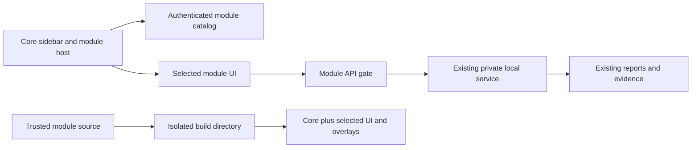

# ADR: opt-in modules without moving notebook data

Status: implemented, initial bundled-module contract (schema version 1).

## Context

A local installation accumulated an eight-stage research feature, signed-in CLI
adapters, local speech and embeddings, provider compatibility fixes and interface
customizations. Injecting a research router into `api/main.py` and copying a whole
frontend obscured ownership and could overwrite upstream fixes.

The core must run without those additions. Existing research URLs, reports,
notebook records, service credentials and operating-system services must survive.

## Decision

Use trusted, versioned source modules in `modules/<id>/module.json`. No arbitrary
Python entrypoints, remote downloads or executable browser scripts are accepted
through the management API. Module services retain their own environments and
private state; only fixed, operator-configured HTTP origins can be proxied.

The core exposes these generic integration points:

* `GET /api/modules`: public metadata behind the existing notebook authentication.
* `PUT /api/modules/{id}`: atomic runtime access configuration.
* `/api/modules/{id}/service/{path}`: authenticated service proxy. Module manifests
  may declare a validated compatibility alias (research retains `/api/research`).
* A generic sidebar contribution, module page host and `/settings/modules` screen.
* A generated frontend catalog. Optional UI source is compiled only when selected.

Three activation types deliberately have different semantics:

| Type | Operation | What remains intact |
|---|---|---|
| `runtime` | Gate UI/API access in the current build | Services, reports, notebook records and files |
| `external` | Operator installs/configures an independent local service or profile | OS process lifecycle stays with its service manager |
| `build` | Explicitly apply source overlays in a new build directory | Original checkout and runtime data |

The manager does **not** claim that a switch undoes compiled CSS, stops Ollama or
kills a native research process. Disabling research first checks its health, active
work, pending exports and unfinished unpaused runs. If those checks fail, access
remains enabled. Shared/exclusive file leases prevent an admitted API submission
from racing a disable request, including across API workers. Existing direct
sidecar callers remain a trusted single-user operator boundary.

Runtime configuration is saved with a private temporary file, fsync and atomic
rename. Corrupt module state fails closed for modules; core notebook routes remain
available. A state file takes precedence over the initial environment defaults.

## Alternatives considered

1. **Keep local patches in core.** Simple, but ownership, rollback and upstream
   integration remain ambiguous.
2. **Runtime arbitrary-code plugin loader.** More flexible, but expands the trust
   surface and requires lifecycle isolation this application does not yet have.
3. **Bundled manifests + separate services + verified build overlays (selected).**
   Small core contract, explicit optional installation and auditable ownership.

## Migration and rollback

`scripts/prepare_modules.py` validates overlay hashes before writing an isolated
build directory. Unknown modules, dependency cycles, changed upstream files,
duplicate overlay targets, existing output directories and route collisions are
rejected. It never applies overlays to the source checkout. Rebuilding without
modules restores a core-only application; reverting the image does not require
reverting research or notebook data. There are no database migrations.

`modules/CUSTOMIZATION-INVENTORY.json` records the local source mapping. Some
differences were older upstream copies rather than personal customizations. Those
are explicitly retired in `local-workspace/UPSTREAM-RECONCILIATION.json` so newer
search, credential, theme, dependency and regression-test fixes are not removed.

## Validation and limits

Test both the core-only and selected-module frontends. Run the module boundary
suite with the normal project dependencies, and each sidecar's existing tests in
its own environment. Exercise authentication and read-only health checks on the
candidate image before changing the running installation.

This first contract targets macOS/Linux operators and uses POSIX file locks. It is
not a plugin marketplace, third-party sandbox, hot code loader or browser-provider
availability guarantee. Optional source overlays are intentionally version-bound;
upstream changes require a reviewed rebase. The existing research retry engine is
preserved; its browser selectors, account quotas and ambiguous provider failures
remain operational constraints rather than problems solved by modular packaging.
